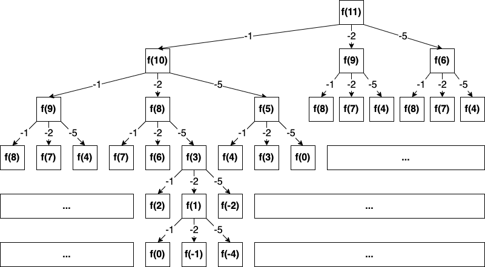
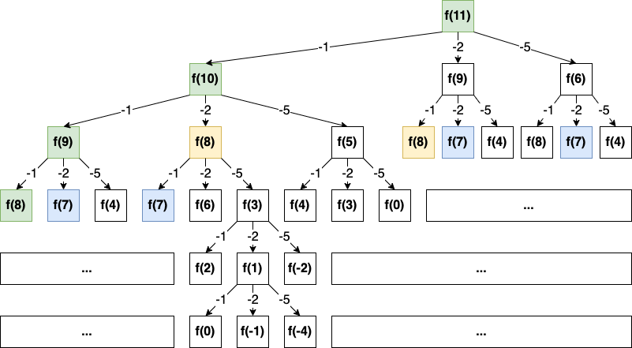

说明：此练习是基于《LeetCode 101: A LeetCode Grinding Guide (C++ Version)》的

# 1.贪心算法

- 定义：保证每次操作**局部最优**，从而使得**结果最优**
- 核心：局部最优 =》 全局最优
- 常见解题思路：
  - `从左到右` **or** `从右到左`
    - `求两两间最优解` => `总体最优解`
  - `从左到右` **and** `从右到左`
    - `从左到右` => `求两两间最优解` => `目前总体最优解`
    - `从右到左` => `求两两间最优解` => `兼顾 从左到右 得到的最优解` => `最终总体最优解`
- [题目](algorithm-training/1.greedy.md)

# 2.双指针

- 定义：遍历数组时，使用两个指针指向不同的元素，从而协同完成任务
- 延伸：
  - 多个数组，多个指针
  - 同一数组
    - 遍历**方向相同**，指针不相交
      - 简称：<b style="color: red">滑动窗口</b>
      - 作用：**区间搜索**
    - 遍历**方向相反**
      - 作用：**搜索**
      - 场景：有序数组
- 常见类型：
  - **快慢指针**
    - 核心思想：在环中，快指针必定会追上慢指针 且 相遇
    - 场景：环形数组 or 链表
  - **首尾指针**
    - 核心思想：从首尾两侧向中间靠拢
    - 场景：有序数组查找目标值
- [题目](algorithm-training/2.double_pointer.md)

# 3.二分查找

- 定义：每次查找时，将待查找区间分成两部分，并只取一部分继续查找
- 场景应用：
  - `有序列表`找目标值
- 常见解题思路：
  - 选择区间：`左闭右开` **or** `左开右闭`
    - 熟练<b style="color: red;">一种</b>即可
  - **死循环**判断：区间只剩 `1 ~ 2` 个值时
- 延伸：
  - 与 `双指针` 比较
    - `双指针`：一步一步移动
    - `二分查找`：每次移动半个区间长度
- [题目](algorithm-training/2.double_pointer.md)

# 4.排序算法

## 4.1比较

| 算法                                             | 平均时间复杂度      | 最优时间复杂度      | 最坏时间复杂度      | 空间复杂度      | 排序方式        | 稳定性 |
|:-----------------------------------------------|:-------------|:-------------|:-------------|:-----------|:------------|:----|
| [快速排序](/src/main/java/sort/QuickSort.java)     | `O(n log n)` | `O(n log n)` | `O(n^2)`     | `O(log n)` | `in-place`  | 不稳定 |
| [归并排序](/src/main/java/sort/MergeSort.java)     | `O(n log n)` | `O(n log n)` | `O(n log n)` | `O(log n)` | `out-place` | 稳定  |
| [插入排序](/src/main/java/sort/InsertionSort.java) | `O(n^2)`     | `O(n)`       | `O(n^2)`     | `O(1)`     | `in-place`  | 稳定  |
| [冒泡排序](/src/main/java/sort/BubbleSort.java)    | `O(n^2)`     | `O(n)`       | `O(n^2)`     | `O(1)`     | `in-place`  | 稳定  |
| [选择排序](/src/main/java/sort/SelectionSort.java) | `O(n^2)`     | `O(n^2)`     | `O(n^2)`     | `O(1)`     | `in-place`  | 不稳定 |

## 4.2说明

- 排序方式：
  - `in-place`：占用常数内存
  - `out-place`：占用额外内存
- 稳定性：排序前后，值相同的元素，位置是否发生变化

## 4.3.[题目](algorithm-training/4.sort.md)

# 5.搜索算法

## 5.1.深度优先搜索：DFS

- 特点：总是优先遍历新节点
- 实现模型：
  - 栈：先进后出
  - 递归：
- 用途：
  - 检测环路
  - 状态记录
  - 可达性检测（避免递归，容易栈溢出）
- 用法：
  - 主函数：
    - 遍历所有的搜索位置
    - 判断是否开始搜索
  - 辅函数：
    - 递归调用

### 5.1.1.[回溯法](/leetcode/first_search/sub0046/Demo01.java)

- 核心：采用试错的思想，分步的解决一个问题
- 原理：
  - 每执行一步，锁定当前状态；
  - 若成功，则继续执行下一步(`DFS 搜索`)；
  - 若失败，解锁，返回上一步，继续尝试另一种可能
  - 直到找出所有的可行结果
- 诀窍：
  - 按引用传递状态
  - 递归结束后，归还所有状态

## 5.2.广度优先搜索：BFS

- 特点：一层层的遍历每个元素
- 实现模型：
  - 队列：先进先出
- 用途：
  - 最短路径
  - 可达性检测

## 5.3.[并查集](/src/main/java/search/UnionFind.java)

- 描述：
  - 一种数据结构
  - 并：合并
  - 查：查找
  - 集：一个字典，存储的内容 `节点 => 父节点`
- 操作：
  - 新增：增加一个新的集合（只拥有一个节点）
  - 查找：查找某个节点属于哪个集合
    - 返回根节点
  - 合并：合并两个有关联的节点
- 使用场景：
  - 不交集森林
  - 连通分量

## 5.4.剪枝

- 定义：一种优化思想
- 原则：
  - 正确性：剪枝后，不能影响结果
  - 准确性：在保证正确性的前提下，尽可能多的剪掉分枝，以达到最优
  - 高效性：在准确性较高的前提下，保证效率也高
    - 剪枝的本质：增加过滤条件，过滤不合理情况
      - 条件过多，会影响效率
      - 需要平衡 `准确性` 和 `高效性`
- 常见策略：
  - 微观：从问题本身出发，发现剪枝条件
  - 宏观：从整体出发，发现剪枝条件
- 分类：
  - 可行性剪枝：当前状态与题意不符，且可推断后续情况也不符，返回
  - 排除等效冗余剪枝：存在多个分支的效果一致，选择其中一个
  - 最优性剪枝：搜索过程中，发现已经比当前最优时效差，返回
  - 顺序剪枝：如搜索一个有序列表中的最小值，从小的一端开始，效率更高
  - 记忆化剪枝：记录每步的状态，发现有相同状态时，返回

## 5.5.[题目](algorithm-training/5.first_search.md)

# 6.动态规划

- 定义：通过把原问题分解为相对简单的子问题的方式来求解复杂问题的方法
- 应用：
  - 重叠子问题
    - 自上而下递归，产生的子问题可能会被多次重复计算
  - 最优子结构问题
    - 局部最优解能决定全局最优解
  - 无后效性
    - 子问题的解一旦确定，不会再改变
- 关键点：`状态转移方程`
- VS 遍历算法（深/广度优先）
  - 求最终状态：动态规划
  - 求所有路径：优先搜索
  - 本质区别：动态规划保存子问题的解，避免重复计算

## 6.0.解题思路

- 例子：leetcode [322. 零钱兑换](https://leetcode.cn/problems/coin-change/)

### 6.0.1.暴力的递归解法

- [代码实现](src/main/java/leetcode/dynamic_programming/sub0322/Demo01.java)

- 画出递归树，用于优化



- `复杂度 = 子问题个数 * 单个子问题耗时`
  - `子问题个数` : `O(2^n)`
  - `单个子问题耗时` : `O(1)`
    - 无循环
- 低效原因：存在大量重复计算
  - 如：
    - `fib(9)` 被计算了 2次
    - ...
- 解决措施：动态规划 - 重叠子问题

### 6.0.2.带备忘录的递归解法

- 动态规划的雏形：`自顶向下`

- [代码实现](src/main/java/leetcode/dynamic_programming/sub0322/Demo02.java)

- 画出递归树，用于优化
  - 只需计算`绿色`的部分
  - 黄色、蓝色 等都是重复计算



- `复杂度 = 子问题个数 * 单个子问题耗时`
  - `子问题个数` : `O(kn)`
  - `单个子问题耗时` : `O(1)`

### 6.0.3.非递归的动态规划解法

- 真正的动态规划：`自底向上`
- [代码实现](src/main/java/leetcode/dynamic_programming/sub0322/Demo01.java)
- 状态转移方程
  - `n` : 目标余额
  - $c_i$ : 硬币面值

$$
f(n) =
\begin{cases}
  0, \qquad\qquad\qquad\qquad\qquad\qquad\qquad n = 0 \\
  \min\{{f(n - c_i)} + 1 \ | \ c_i \in [1, k] \}, \qquad n > 0
\end{cases}
$$

## 6.1.分割类型

## 6.2.子序列类型

- `dp[i][j]`：表示 `word1[0:i]` 变为 `word2[0:j]` 所需要的最少步数

## 6.3.背包问题

### 6.3.1.[0-1]背包

- 定义：每次只能选取 `0~1` 个不同物品
- 内层遍历：`逆向遍历`

### 6.3.1.无界背包

- 定义：每次可以选取 `0~N` 个相同物品
- 内层遍历：`正向遍历`

## 6.4.股票问题

- 定义两个数组：
  - `buy` : 买入后，剩余的最大利润
  - `sell` : 卖出后，获得的最大利润

## 6.5.[题目](algorithm-training/6.dynamic_programming.md)

# 7.分治算法

- 定义：将**原问题**分为**子问题**，再将子问题进行处理合并，从而实现对原问题的求解

## 7.2.[题目](algorithm-training/7.devide_and_conquer.md)

# 8.位运算

- 定义：利用二进制的位运算特性进行一些优化和计算

## 8.1.原码/反码/补码

- `二进制组成` : `符号位`、`数值`
  - `符号位` : 最高位（`0` : 正数; `1` : 负数;）
  - `数值` : 由 `0` 和 `1` 组成

|     | 正数 | 负数 |
| --- | --- | --- |
| 原码 | `符号位 = 0` | 求`绝对值`，`取反`，`+1`，`符号位 = 1` |
| 反码 | 与 `原码` 相同 | `符号位` 不变，其他位 `取反`(0 -> 1, 1 -> 0) |
| 补码 | 与 `原码` 相同 | `反码 + 1` |

- 示例

| | `5` | `-5` |
| --- | --- | --- |
| 原码 | `0000 0101` | `1111 1011` |
| 反码 | `0000 0101` | `1000 0100` |
| 补码 | `0000 0101` | `1000 0101` |

- 负数转二进制过程

| 流程 | `-5` |
| --- | --- |
| 取绝对值 | `0000 0101` |
| 取反 | `1111 1010` |
| +1 | `1111 1011` |
| 符号位改为1 | `1111 1011` |

## 8.2.位运算符

| 运算操作 | 运算符 | 示例 |
| --- | --- | --- |
| 按位 异或 | `^` | `0 ^ 1 = 1`, `0 ^ 0 = 0`, `1 ^ 1 = 0` |
| 按位 与 | `&` | `0 & 1 = 0`, `0 & 0 = 0`, `1 & 1 = 1` |
| 按位 或 | `|` | `0 | 1 = 1`, `0 | 0 = 0`, `1 | 1 = 1` |
| 取反 | `~` | `~0 = 1`, `~1 = 0` |
| 算术左移 | `<<` | `1111 1111 << 1 = 1111 1110`, `1111 1111 << 2 = 1111 1100` |
| 算术右移 | `>>` | `1111 1111 >> 1 = 0111 1111`, `1111 1111 >> 2 = 0011 1111` |

```text
- 0s : 全部有 0 组成的二进制数字
- 1s : 全部有 1 组成的二进制数字

# 按位 异或
x ^ 0s = x
x ^ 1s = ~x
x ^ x = 0

# 按位 与
x & 0s = 0
x & 1s = x
x & x = x

# 按位 或
x | 0s = x
x | 1s = 1s
x | x = x
```

- 常见用法

```text
# 去除 n 的位级表示中最低的那一位
n & (n - 1)

# 得到 n 的位级表示中最低的那一位
n & (-n)
```

| `n` | `n & (n - 1)` | `n & (-n)` |
| --- | --- | --- |
| 123 | 122 | 1 |
| 214 | 212 | 2 |
| 358 | 356 | 2 |
| 437 | 436 | 1 |
| 508 | 504 | 4 |
| 612 | 608 | 4 |

## 8.3.[题目](algorithm-training/8.bitwise_operation.md)
